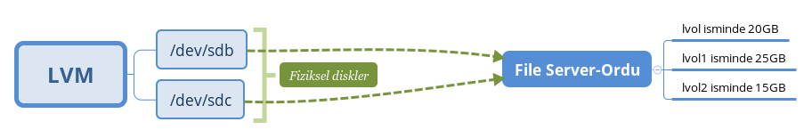

# GNU / Linux: System Management 1.5 Exercises

In Mustafa Akgül Free Software Winter Camp, I talked about lvm in the class of [GNU / Linux: System Management 1.5](https://kamp.linux.org.tr/2019/kis/kurslar/gnu-linux-sistem-yonetim-15/) . Some exercises were not trained. By doing these exercises, you will not forget about the topics and understand the advantages of LVM.

Normally we had to do some of these exercises in the classroom. These exercises will help you better understand and forget about LVM. It is a good idea to share your exercises under the branch you created with your name. I will be interested if you write down the problems you encounter.

I will ask you to do the system given in the picture through lvm. It is better to do the exercises given later on this system. You should take clones from Centos 7's minimal distribution and do the exercises on different clones.

1-) Add a new physical disk to this system. Add the physical disk to the file server volume group so that the data of the logical partitions are moved to the new disk. Disconnect the old disk from the system. The important detail is that the size of the old physical part should be the same as the size of the newly added physical part.

2-) Add a new disk, create a new volume group on a new disk. Let the volume group name be image server. Move lvol1 and data from the logical partitions in the file server group to the image server volume group you just created.

3-) Move the logical sections of lvol1 and lvol2 in the file server volume group to a new side volume group with a single command.

4-) What is snapshot in LVM? In the file server group, take a snapshot of the lvol1 section. Then activate snapshop and write something in it. Compare the size of the snapshot with the size of the lvol1 section. Summarize what Snapshot is with a paragraph.

5-) What is the difference of lvreduce, lvextend and lvresize commands? What are the same commands in vg and pvs?

6-) Investigate the subject of creating cache in LVM.

If cache is used efficiently:

Commands:

