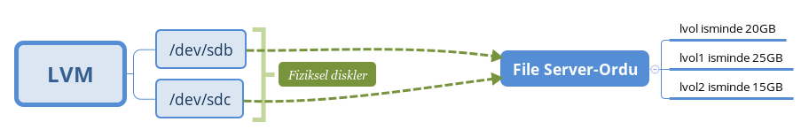
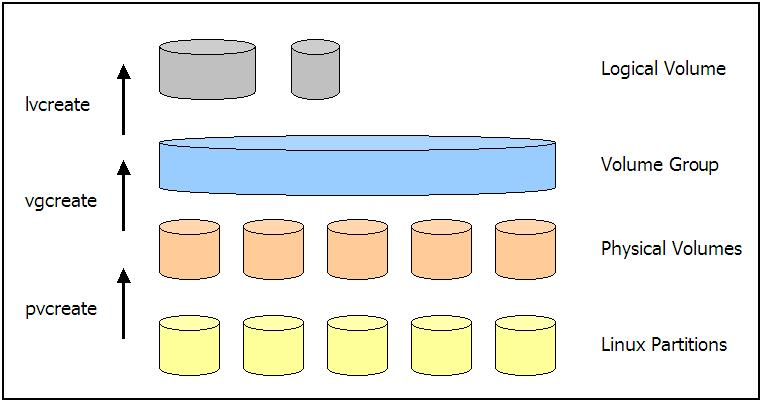
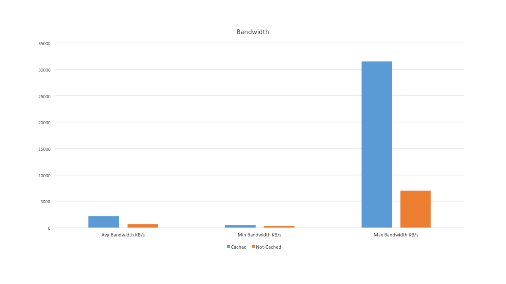

# GNU/Linux: Sistem Yönetimi 1.5 Alıştırmaları

Mustafa Akgül Özgür Yazılım Kış Kampında, [GNU/Linux: Sistem Yönetimi 1.5](https://kamp.linux.org.tr/2019/kis/kurslar/gnu-linux-sistem-yonetimi-15/) sınıfında lvm konusunu anlattım. Bazı alıştırmalar yetişmemişti. Bu alıştırmaları yaparak hem konuları unutmamış olursunuz hem de lvm'in avantajlarını iyi anlamış olursunuz. 

Normal durumda bu alıştırmaların bazılarını sınıfta yapmamız gerekiyordu. Bu alıştırmalar lvm'i daha iyi anlamanıza ve unutmamanıza yardımcı olacaktır. Yaptığınız alıştırmaları isminiz ile oluşturduğunuz branch altında yapmanız iyi olur. Karşılaştığınız sorunları yazarsanız da ilgilenirim.

Fotoğrafta verilen sistemi, lvm aracılığıyla yapmanızı isteyeceğim. Sonrasında verilen alıştırmaları bu sistem üzerinden yapmanız daha iyi olur. Centos 7'nin minimal imageı üzerinden klonlarını alıp, alıştırmaları farklı klonlar üzerinden yapmanız gerekmektedir.

1-) Bu sisteme yeni bir fiziksel disk ekleyin. Fiziksel diski file server volume grubuna ekleyip, mantıksal bölümlerin verilerinin yeni diske taşınmasını sağlayın. Eski diski sistemden ayırın. Önemli ayrıntı eski fiziksel bölümün kısmın boyutu ile yeni eklenen fiziksel bölümün boyutunun aynı olması gerekmektedir.

2-) Yeni bir disk ekleyin, yeni bir diske yeni bir volume group oluşturun. Volume group ismi image server olsun. File server grubunda olan mantıksal bölümlerden lvol1 verilerini yeni oluşturduğunuz image server volume group'a taşıyınız.

3-) File server volume groupunda bulunan lvol1 ve lvol2 manıtksal bölümlerini, tek bir komut ile yeni bir yan volume groupa taşıyınız.

4-)LVM'de snapshot nedir? File server grubunda lvol1 kısmının snapshotını alın. Sonrasında snapshotı aktif edip içine bir şeyler yazın. Snapshotın boyutu ile lvol1 bölümünün boyutunu karşılaştırınız. Snapshot ne olduğunu bir paragraf ile özetleyiniz.

5-) LVM'de cache oluşturma konusunu araştırınız.

6-) lvreduce, lvextend ve lvresize komutlarının farkı nedir? vg ve pv'ler içinde aynı komutlar var ne işe yarar ve farkı nedir?

Komutlar:

Cache'in verimli kullanılması durumunda:

